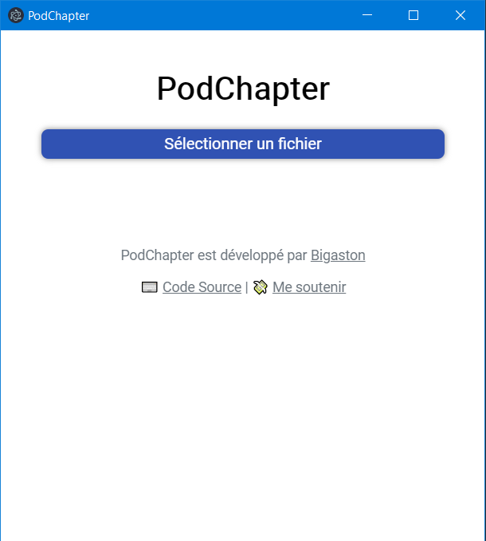
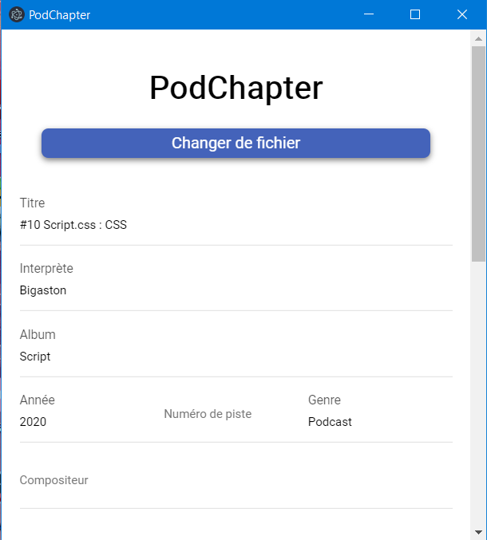
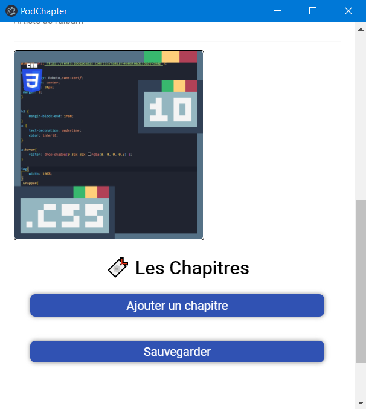

# PodChapter
PodChapter est un petit outil codé à partir de Electron et permetant d'éditer les métadonnés de vos fichier .mp3, ainsi que d'ajouter des chapitres dans ces fichiers

  

**Pourquoi avoir recommencé le développement de zero?**
Pour pouvoir s'affranchir de FFMPEG! Dans la première version PodChapter utilisait FFMPEG pour mettre les chapitres dans le fichier MP3, mais cela nécessitait de l'installer à la main. De plus les accents étaient mal supportés. Mais depuis, un module Node appelé [node-id3](npmjs.org/package/node-id3) est sortit et nous permet de faire le travail depuis NodeJS, et de manière plus propre.
L'application est codée en Electron ce qui la rend un peu plus lourde et plus lente à démarrer mais cela nous donne aussi une certaine facilitée de développement.

## Téléchargements

<!--RELEASE_LINKS_START-->

### Windows

- [Installer](https://github.com/Bigaston/podchapter/releases/download/2.2.3/PodChapter-Setup-2.2.3.exe)
- [Web Installer](https://github.com/Bigaston/podchapter/releases/download/2.2.3/PodChapter-Web-Setup-2.2.3.exe)
- [Portable](https://github.com/Bigaston/podchapter/releases/download/2.2.3/PodChapter-2.2.3.exe)

### Mac

- [DMG](https://github.com/Bigaston/podchapter/releases/download/2.2.3/PodChapter-2.2.3.dmg)

### Linux

- [AppImage](https://github.com/Bigaston/podchapter/releases/download/2.2.3/PodChapter-2.2.3.AppImage)
- [snap](https://github.com/Bigaston/podchapter/releases/download/2.2.3/podchapter-2.2.3.snap)
- [deb (Ubuntu, Debian, etc)](https://github.com/Bigaston/podchapter/releases/download/2.2.3/podchapter-2.2.3.deb)
- [rpm (Fedora, etc)](https://github.com/Bigaston/podchapter/releases/download/2.2.3/podchapter-2.2.3.x86_64.deb)
- [pacman (Archlinux, Manjaro, etc)](https://github.com/Bigaston/podchapter/releases/download/2.2.3/podchapter-2.2.3.pacman)

<!--RELEASE_LINKS_END-->

Rendez vous dans la partie [Release](https://github.com/Bigaston/podchapter/releases/latest) du dépot GitHub pour tous les liens.

## Crédits
Développé par [Bigaston](https://twitter.com/Bigaston) avec l'aide de [PofMagicfingers](https://twitter.com/PofMagicfingers/)
Une partie des composants ont été fait par [Phil_Goud](https://twitter.com/Phil_Goud)

💸 [Me soutenir](https://utip.io/bigaston)
