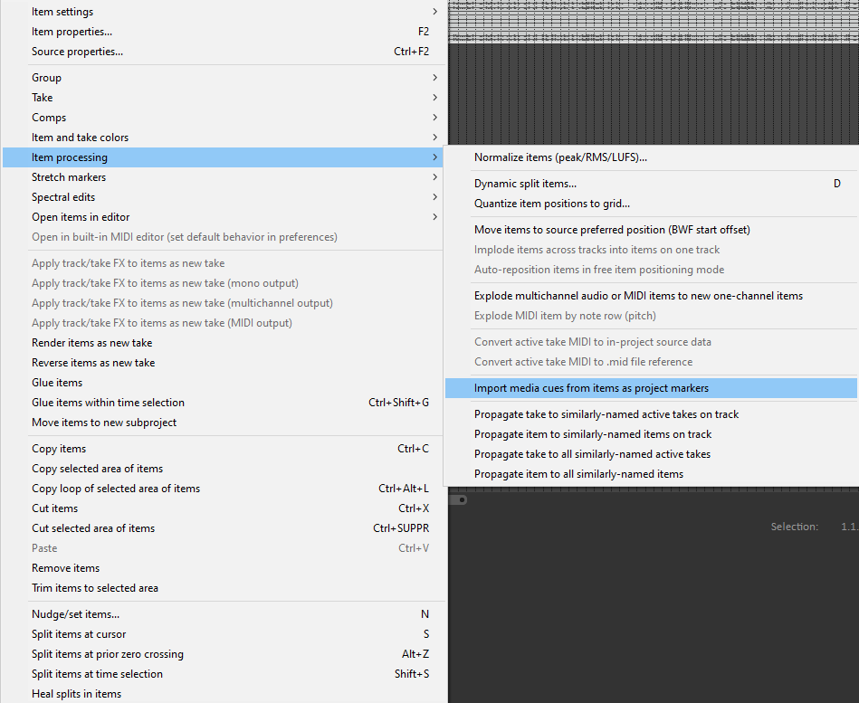
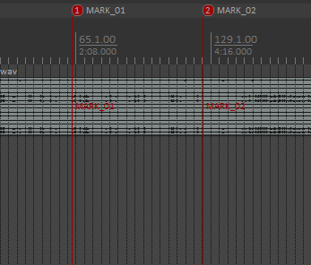
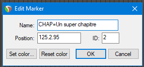
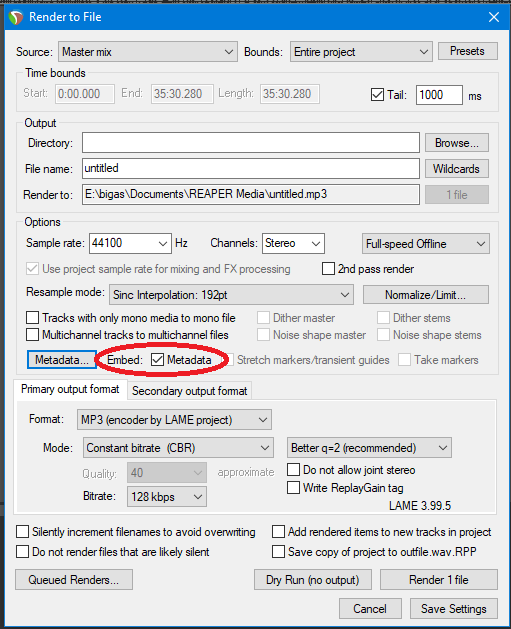

# Importer ses chapitres depuis Reaper

## 0. Importer les marques existantes

Si vous utilisez une table de mixage comme la Tascam Mixast 4, la Rodecaster Pro ou un Zoom H5, vous pouvez ajouter des marqueurs durant votre enregistrement.
Ces marqueurs seront directement encodé dans votre fichier audio (souvent .wav) et vous pourrez alors l'importer dans Reaper comme marqueur.  
Pour ce faire, importez votre fichier dans Reaper, puis faites **Click droit > Item processing > Import media cues from items as project markers**.

## 1. Ajouter des marques pendant son montages

Vous pouvez maintenant ajouter des marqueurs via le racourci clavier **Maj + M** ou avec **Clique droit sur la timeline > Insert Marker**  
Ces marqueurs, en plus d'être très utile pour vous repérer pendant le montage, peuvent être exporté dans votre fichier MP3, pour être ajouté automatiquement à PodChapter quand vous voudrez modifier leurs couvertures ou les métadonnés du fichier.

## 2. Nommer ses marqueurs

Pour que les marqueurs soient exportés en tant que chapitre, il faudra modifier leurs noms.
Commencez par double cliquer sur l'icone rouge, puis modifiez le nom pour qu'il commence par **CHAP=**. Le texte ensuite sera celui de votre chapitre.

## 3. Exporter ses marqueurs

Enfin, lors du rendu de vos fichiers, cochez la case **Metadata** à la suite de **Embed:**

Et voilà, vos chapitres ajoutés durant votre montage sont dans votre fichier MP3! Plus qu'à ouvrir le fichier dans PodChapter pour éditer plus précisément ces chapitres.
